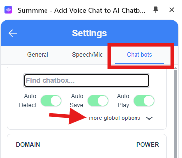

# Keyboard to TTS

Summme 1.0 no longer has keyboard TTS as the default with the addition of Voice Chat and STT. For many users this is still a valuable feature and is still supported. To re-enable it follow these quick few steps. 

### Step 1 - Open Summme sidebar

Open Summme sidebar in the browsers extensions drop down menu 

Tip: Pin Summme icon for faster access. Then go to Settings.

### Step 2 - Go to Settings > Chat bots

### Step 3 - Switch on global Keyboard Enter Key (Auto Play)

Select the  **more global options** buttons. Then click the switch dial to ON(green) for
 **Keyboard Enter Key (Auto Play)**

- 

#### Step 4 - Optional - Enable Domain specific Keyboard TTS

Option 1: You can switch on keyboard TTS for specific domains only.
Go to the Domains section in  **Settings > Chat bots**. 

Then either search for the domain with the Find chatbox... input field or 

scroll through the list to find the domain you want to update.

Click on the down arrow next to the  **Auto play (read aloud)** row.  
Change the **Auto play on 'Enter' key press**  switcher dial to ON(green).

Option 2: Navigate to the specific chatbot site domain in your browser tab. Next go to the Summme vertical toolbar (bottom right)

Click the audio speaker button. In the window that pops up click **Enable Auto play on Enter key press** button

